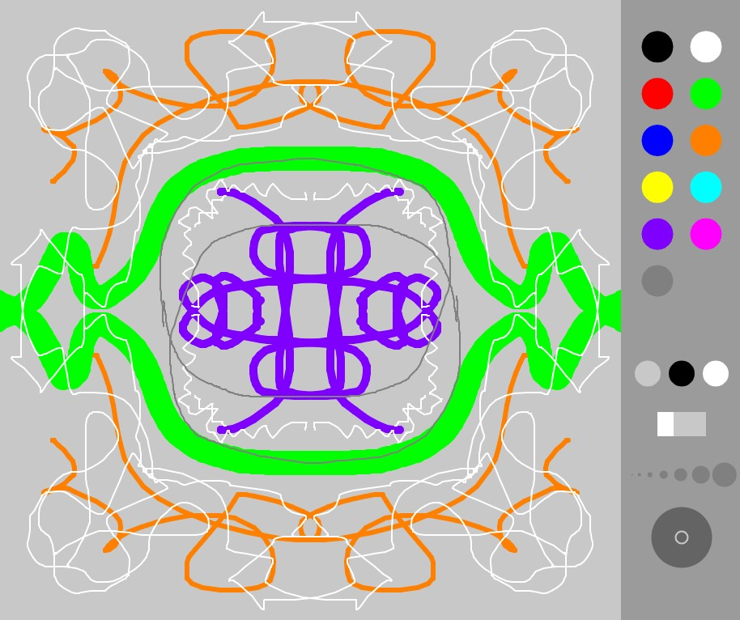

# sprials
Symmetry drawing app made in Processing

A simple app for drawing patterns and spirals. You can choose between different symmetry modes. The drawing is super simple and the UI is bad.
You can test it out in the [web app](weirdy.dev/spirals).

